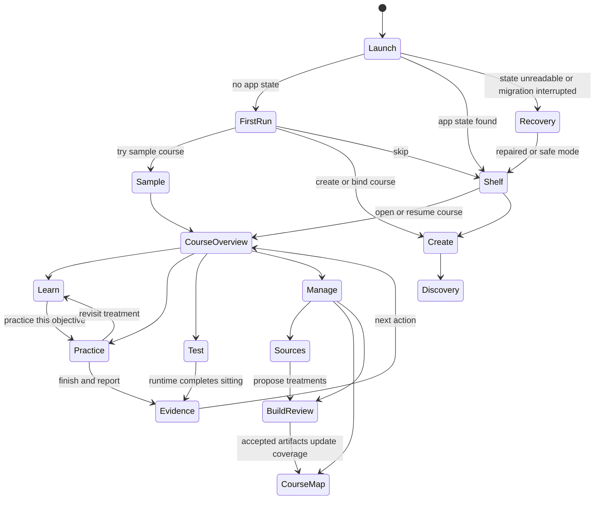
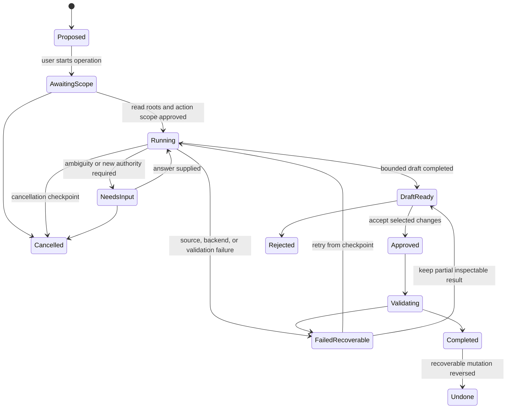
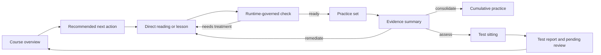

# Stream 09: app flow and information architecture

**Status:** research input for Phase 16, not a binding product decision

**Access date for web sources:** 2026-08-13

**Scope:** the logical packaged-app experience, independent of Phase 17 visual styling

## 1. Scope and research questions

This stream asks what the app should show, in what order, and how a learner or
course builder moves between source discovery, course construction, learning,
practice, testing, evidence, and resumption. It covers:

- first launch, a sample course, optional walkthroughs, empty states, help,
  permissions, and returning-user resumption;
- creating a course from a book, syllabus, folder, old lesson, bank,
  executable notebook, or no existing material;
- discovery, explicit file binding, build proposals, review, approval, undo,
  conflicts, diagnostics, and unavailable-agent states;
- course map, learn, notes, practice, test, evidence, search, settings, and
  agent activity;
- desktop and narrow windows, keyboard and touch, novice and expert paths,
  long operations, interruption, failure, recovery, deep links, and back
  behavior.

The research does not select typography, color, iconography, illustration,
motion style, or a component library. It does not copy a competitor's layout,
brand, content, or assets. Wireframes show hierarchy and flow only.

### Research questions

1. What is the smallest stable set of top-level destinations?
2. Which states belong to the shelf, a course, an activity, or app utilities?
3. How can learning remain primary while source and build work stay close?
4. How should a user understand agent scope, progress, proposals, and writes?
5. What persists across window size changes, interruptions, restarts, offline
   use, and unavailable agents?
6. Which information is always visible, contextual, progressively disclosed,
   or never learner-facing?
7. How do existing shipped bank surfaces migrate into course-first navigation
   without creating a second parser, scorer, or evidence store?

## 2. Sources and evidence quality

### 2.1 Repository sources and shipped behavior inventory

These are primary project sources. They were inspected in the working tree on
2026-08-13.

| Source | Type | Relevant observed fact |
|---|---|---|
| [AGENTS.md](../../../AGENTS.md) | Binding repository on-ramp | One parser and one scorer; runtime owns assessment authority; evidence and banks stay on disk; discovery is read-only by default; course work finds before creating. |
| [Source-to-course contract](../../SOURCE-TO-COURSE.md) | Binding product direction | Home becomes a course shelf. A course has Learn, Practice, Test, Sources, Course map, and Build / review. Files remain durable and derived indexes disposable. |
| [Planning directives](../../PLANNING-DIRECTIVES.md) | Binding planning rules | Phase 16 defines logical experience before Phase 17 visual design. Networked capability may degrade but cannot block the core loop. |
| [Roadmap](../../ROADMAP.md) | Sequenced product contract | Phases 14 and 15 provide course binding and agent course direction before the Phase 16 flow contract is implemented in Phase 17. |
| [Phase 16 research index](README.md) | Research brief | Stream 09 must include state diagrams, task flows, screen inventory, and desktop and narrow wireframes. |
| [Daemon route and parity inventory](../../../surfaces/daemon.py) | Shipped code | One daemon serves index, quiz, study, lesson, report, settings, disclosure, glossary, day, seed acceptance, and session APIs. Each daemon route has a named CLI twin. |
| [README](../../../README.md) | Shipped user documentation | Current capabilities include lint, build, sessions, evidence reports, retention trends, reader, study, day, audio export, seeding, themes, updates, and packaged sidecar launch. |
| [Quiz page](../../../surfaces/quiz_page.py) | Shipped code | Browser quiz starts and submits through runtime APIs and renders server-issued verdicts; it does not score independently. |
| [Seeding surface](../../../surfaces/seeding.py) | Shipped code | Item generation uses staged review and has a degraded state when no model backend exists. |

#### Shipped behavior, not future-state inference

- **Fact:** `/` scans banks and day plans, shows actions for each, links the
  newest report for a bank when one exists, distinguishes a truly empty root,
  and warns about filename-stem collisions with a recovery instruction.
- **Fact:** direct routes exist for quiz, study, lesson, glossary, report, day,
  settings, disclosure, key review, and seed acceptance. JSON routes cover
  start, next, submit, hint, interaction, report, override, lesson completion,
  rubric review, audio export, and lesson code execution.
- **Fact:** the route table is paired with CLI commands. Current browser and
  CLI surfaces are alternate clients over shared runtime calls.
- **Fact:** reports distinguish auto-marked attempts from pending manual prose.
  Sessions and evidence are local files.
- **Fact:** current primary navigation is effectively a scanned bank/day-plan
  index. The course shelf and six-area course workspace are planned, not
  shipped.
- **Fact:** packaged launch, update disclosure, side-by-side update landing,
  settings, offline lesson assets, and an ordinary-browser fallback already
  exist in the shipped foundation.

### 2.2 Current external product and platform sources

All links below were accessed 2026-08-13.

| Source | Source type | Relevant observed fact and limitation |
|---|---|---|
| [Google, Create a notebook in NotebookLM](https://support.google.com/notebooklm/answer/16206563?hl=en) | Current official product help | A notebook begins with sources and exposes source-grounded chat plus a studio of generated artifacts, including notes, reports, flashcards, quizzes, audio, mind maps, and other outputs. A notebook is independent. This documents behavior, not learning effectiveness. |
| [Google, Add or discover sources](https://support.google.com/notebooklm/answer/16215270?co=GENIE.Platform%3DDesktop&hl=en) | Current official product help | Source selection is explicit, source types and limits are visible, imports may be copies or synced representations, and inaccessible or deleted upstream files affect availability. This is a useful contrast because itembank defaults to links in place. |
| [Google, Learn about NotebookLM](https://support.google.com/notebooklm/answer/16164461?hl=en) | Current official product help | Grounded answers show inline citations and source material can be transformed into several study formats. It does not establish an objective-led course path. |
| [Apple, Onboarding](https://developer.apple.com/design/human-interface-guidelines/onboarding) | Current platform guidance | Onboarding should be fast and optional, teach through safe interaction, put instructions near the relevant interface, defer nonessential setup, and request permission when the related function is used or after explaining why. |
| [Apple, Design principles](https://developer.apple.com/design/human-interface-guidelines/design-principles) | Current platform guidance | Guided flows should be escapable, actions need feedback, permission requests need rationale, and recovery should preserve work and make reversal easy. |
| [Android, Build adaptive navigation](https://developer.android.com/develop/adaptive-apps/guides/build-adaptive-navigation) | Current official platform documentation | A small stable set of top-level destinations can change presentation by window width, such as bottom navigation in compact windows and a rail in expanded windows. |
| [Android, Adaptive do's and don'ts](https://developer.android.com/develop/adaptive-apps/guides/adaptive-dos-and-donts?hl=en) | Current official platform documentation | List-detail and supporting-pane layouts should adapt rather than simply stretch. Keyboard, mouse, and touch remain concurrent inputs. |
| [VS Code, Workspace Trust](https://code.visualstudio.com/docs/editing/workspaces/workspace-trust) | Current official product documentation | Untrusted folders open in a restricted, browsable state; risky capabilities are limited; a visible banner and status entry explain the restriction; trust can be granted later. This is a relevant pattern for executable notebooks and agent writes. |
| [VS Code, Trust and safety](https://code.visualstudio.com/docs/agents/concepts/trust-and-safety) | Current official product documentation | Agent side effects and commands can require approvals with explicit scope. Workspace, network, extension, and tool trust are separate boundaries. |
| [W3C, WCAG 2.2](https://www.w3.org/TR/WCAG22/) | Normative accessibility standard | Relevant requirements include focus order, multiple ways to locate pages, consistent navigation and help, visible and unobscured focus, target size, dragging alternatives, error identification, and status messages. |
| [W3C, ARIA Authoring Practices patterns](https://www.w3.org/WAI/ARIA/apg/patterns/) | Current accessibility implementation guidance | Breadcrumbs express hierarchy; status messages need not interrupt; alert dialogs are reserved for important interruptions that require a response. |
| [GOV.UK, Accordion](https://design-system.service.gov.uk/components/accordion/) | Public design-system guidance informed by service research | Hidden sections can help comparison for repeat users, but important content should not be hidden and ordinary headings or separate pages are often better. This is guidance, not a universal experimental result. |

### 2.3 Learning and interruption research

| Source | Source type | Finding and limitation |
|---|---|---|
| [Trafton et al., Preparing to resume an interrupted task](https://doi.org/10.1016/S1071-5819(03)00023-5) | Peer-reviewed controlled experiment | An interruption warning interval supported preparation and improved resumption. The task environment was experimental and does not directly test studying. |
| [Altmann and Trafton, Task interruption: resumption lag and the role of cues](https://escholarship.org/uc/item/18b4r661) | Primary conference paper | External cues available around interruption reduced resumption cost in the studied task. It supports resumable context cues, not a specific UI component. |
| [Dunlosky et al., Improving Students' Learning With Effective Learning Techniques](https://doi.org/10.1177/1529100612453266) | Peer-reviewed review | Practice testing and distributed practice received high utility ratings across broad conditions. The review does not prescribe navigation or visual layout. |
| [Roediger and Karpicke, Test-enhanced learning](https://doi.org/10.1111/j.1467-9280.2006.01693.x) | Peer-reviewed experiments | Retrieval practice improved delayed retention compared with repeated study in the tested verbal-learning conditions. This supports a visible practice path, not constant quizzing. |

## 3. Facts, inferences, recommendations, and open questions

### 3.1 Facts

1. The repository has deterministic learning and assessment capabilities but
   no shipped course-first shell.
2. The binding product direction names the course as the user-facing unit and
   six areas within it.
3. Source discovery does not confer write permission. Link, import, copy,
   move, and supersede have distinct meanings.
4. Agent output is a proposal or bounded write with citations, uncertainty,
   validation, approval, and undo. The model is not scoring authority.
5. Current platform guidance supports optional contextual onboarding,
   adaptive navigation presentation, accessible hierarchy, visible status,
   and recovery.
6. Interruption research supports preserving a concrete resumption cue.

### 3.2 Inferences

1. A permanent global destination for every capability would overfit the
   current command inventory and obscure the course journey.
2. Learn, Practice, and Test are the learner's recurring modes. Sources,
   Course map, and Build / review are course-management modes. They can share
   a workspace without receiving equal prominence for every user at all times.
3. Agent activity is cross-cutting work state, not a learning destination. It
   needs an activity center and contextual entry points, not a chat-first home.
4. Returning users benefit more from one precise resumption card than from a
   generic dashboard of metrics.
5. Deep links must identify stable course, objective, artifact, activity, and
   session identities. Raw file paths and filename stems are not durable links.
6. Narrow screens should preserve the same conceptual locations while moving
   supporting panes into a navigable stack.

### 3.3 Recommendations

1. Use a two-level IA: app shelf and utilities, then a course workspace.
2. Make **Home**, **Search**, and **Activity** the stable app-level
   destinations. Inside a course, make **Learn**, **Practice**, **Test**, and
   **More** the compact primary set; More contains Course map, Sources, Notes,
   Build / review, and Evidence. On wide screens, show all course areas in a
   course rail while preserving their grouping.
3. Put a single next-action module first on the course overview and follow it
   with resume, due work, build/review attention, and course-map gaps.
4. Keep source and agent status visible only when it affects the current task.
5. Treat every long operation as a durable job with phase, scope, elapsed
   state, safe navigation away, cancel behavior, and a result or recovery
   destination.
6. Restore semantic context after restart: course, mode, objective, artifact,
   position, draft state, and the exact next valid action.

### 3.4 Open questions

1. Should Notes be a distinct course area or an output filter within Learn
   until user research shows frequent cross-course note navigation?
2. Is Evidence visible to all learners by default, or summarized within Learn
   with a detailed area for experts and instructors?
3. Which course-build operations may be approved as a batch, and which always
   need per-artifact review?
4. Can an executable notebook be marked trusted per file, per containing root,
   or only per explicit run?
5. Does the packaged shell control native back and deep-link registration on
   every supported OS, or must browser history remain the only universal floor?

## 4. Proposed information architecture

### 4.1 Object model and containment

```text
App
├── Home: course shelf, recent work, resume, create/open
├── Search: courses, objectives, sources, accepted artifacts, notes, evidence
├── Activity: agent jobs, imports, indexing, approvals, errors, completed work
├── Help: contextual topics, walkthrough replay, keyboard reference, README
├── Settings: app, learning, agent, roots, privacy, update, accessibility
└── Diagnostics: health, versions, roots, permissions, indexes, logs, repair
    └── Course
        ├── Overview: next action, resume, due, attention, recent
        ├── Learn: readings, guided lessons, terms, examples, reviews
        ├── Practice: retrieval and transfer sets
        ├── Test: diagnostic, unit, cumulative, blueprint sittings
        ├── Notes: learner-authored and accepted generated notes
        ├── Evidence: attempts, pending review, retention, uncertainty
        ├── Course map: objectives, prerequisites, treatment, gaps
        ├── Sources: roots, files, locators, bindings, conflicts
        └── Build / review: plans, drafts, diffs, citations, validation, undo
```

**Recommendation:** Overview is the course landing state, not a seventh area
in the durable content model. It composes summaries and next actions from the
six contract areas plus Notes and Evidence.

### 4.2 Primary and secondary navigation

| Context | Primary navigation | Secondary navigation | Contextual controls |
|---|---|---|---|
| Shelf, wide | Home, Search, Activity | Settings, Help, Diagnostics | Create course, open existing course |
| Course, wide | Overview, Learn, Practice, Test, Course map, Sources, Build / review | Notes and Evidence can be promoted after validation; app utilities remain separate | Objective filter, unit selector, current agent/job status |
| Shelf, narrow | Home, Search, Activity | Settings and Help in app menu | Create or open |
| Course, narrow | Learn, Practice, Test, More | Overview is reached by course title/back; More lists Map, Sources, Notes, Evidence, Build / review | Current objective and next action |
| Focused activity | Activity content, not global chrome | Outline or item navigator on demand | Save/exit, progress, source, hint entitlement where legal |

The compact set is intentionally smaller than the full wide rail. This is an
adaptive presentation of the same destinations, not a different information
model.

### 4.3 Breadcrumbs, back, and escape

- Breadcrumbs represent durable hierarchy: `Course > Unit > Objective >
  Lesson`, `Course > Build / review > Proposal`, or `Course > Sources > File`.
- Browser or native Back returns to the prior view state, including filters and
  scroll position. It does not mean “go to parent.” A breadcrumb goes to a
  parent.
- Escape closes the topmost temporary layer, then returns focus to its opener.
  It does not abandon a sitting or discard a draft.
- Leaving an active practice session preserves the session and offers Resume.
  Leaving a formal test requires explicit Pause, if mode permits, or Exit with
  a statement of what will happen. The UI never changes runtime policy.
- A mode switch that would create a new session says so. Learn to Practice can
  preserve objective context, but it cannot silently convert a lesson check
  into a scored test.
- The course title always returns to course Overview. The app mark or shelf
  button returns Home without destroying course or activity state.

### 4.4 Deep links and recent work

Use opaque stable identifiers in links, with a human-readable slug only as a
label. Recommended conceptual forms:

```text
itembank://course/{course_id}
itembank://course/{course_id}/objective/{objective_id}
itembank://course/{course_id}/artifact/{artifact_id}?anchor={stable_anchor}
itembank://session/{session_id}
itembank://job/{job_id}
```

If native protocol registration is unavailable, equivalent loopback HTTP URLs
are the floor. Resolution goes through the course index and runtime allowlists,
never string-concatenated file paths.

Recent work records semantic checkpoints, not merely pages:

- “Resume Unit 2 lesson at Worked example 3”
- “Continue practice, 4 of 10 submitted”
- “Review 3 source-binding conflicts”
- “Approve or reject the draft treatment for Objective O-17”

Do not place a completed test answer or keyed content in a recent-item preview.

### 4.5 What appears when

| Visibility | Content |
|---|---|
| Always visible in course chrome | Course identity, current area, navigation escape, save/sync state for local mutations, and any restriction that affects the current action |
| Always visible in focused learning | Activity title, objective or purpose, position, exit/resume control, and runtime-issued state |
| Contextually visible | Source citation, agent status, approval scope, pending manual review, offline limitation, file conflict, lesson outline, test rules |
| User-invoked supporting pane | Source preview, glossary, objective detail, evidence detail, agent rationale, diff metadata, keyboard reference |
| Progressively disclosed | Expert tips, diagnostics detail, raw provenance, validation traces, advanced selection controls, root policy, model configuration |
| Never shown to learner before entitlement | Correct keys, hidden rationales, answer models, internal scoring fields, higher feedback tiers |
| Never inferred by UI | Mastery without a defined denominator, prose correctness before approved marking, agent certainty not supported by evidence |

## 5. State diagrams and mode transitions

### 5.1 App and course state



### 5.2 Agent job and approval state



**Recommendation:** “Agent working” is never a blocking modal. The job stays
in Activity, exposes its current phase and approved scope, and sends a status
message when it changes. Only a required decision may interrupt, and even then
the user can defer it and continue elsewhere.

### 5.3 Learning, practice, and test boundaries



Learn, Practice, and Test retain separate names, entry explanations, feedback
rules, and completion semantics. Visual similarity must not blur authority.

## 6. Chained task flows

### 6.1 First launch and sample course

1. Launch completes before onboarding.
2. Show a short welcome with three actions: **Try sample course**, **Create
   from my files**, and **Open existing course**. A quiet **Skip to empty
   shelf** remains available.
3. Explain local files, optional agent use, and update behavior in plain
   language. Do not request file roots or model credentials yet.
4. The bundled synthetic sample opens at Overview with a highlighted next
   action. A contextual walkthrough asks the user to perform three safe
   actions: open a reading, answer a practice item, inspect its evidence.
5. The walkthrough can be skipped, replayed from Help, and never blocks the
   sample.
6. After the sample, offer “Create your course with this structure” and retain
   no fabricated evidence on the user's shelf unless they choose to keep the
   sample.

### 6.2 Book or syllabus to reviewed course

```text
Create course
  > Name and target
  > Choose explicit read root or individual file
  > Explain link-in-place default and requested permissions
  > Inventory and fingerprint
  > Review found sources and prior artifacts
  > Resolve identity conflicts
  > Draft objective map with citations and uncertainty
  > Review objective map
  > Choose treatment per objective
  > Build only missing artifacts
  > Review diffs, validation, citations, and scope
  > Accept selected artifacts
  > Course Overview shows first next action
```

At every step, save a checkpoint and show what remains reversible. The user
may leave after inventory and return to “Review 2 likely duplicates,” rather
than restarting a wizard.

### 6.3 Existing folder, old lesson, or question bank

1. Choose a folder or explicit files.
2. Discovery stays read-only and reports what it searched.
3. Group candidates as source, accepted artifact, draft, assessment, evidence,
   unsupported, or uncertain.
4. Show likely relationships with fingerprints and provenance. Similar names
   are not silently merged.
5. User chooses link, import, copy, move, supersede, ignore, or decide later.
6. Legacy lesson or bank is audited before enhancement. The proposal preserves
   identity and assessment meaning.
7. Accepted bindings appear in Sources and Course map. Unsupported artifacts
   remain visible as unresolved, not discarded.

### 6.4 Executable notebook

1. Detect mixed prose, code, output, data, and interaction.
2. Open in restricted preview. Reading and metadata inspection remain allowed.
3. Explain that rendering saved output differs from executing code.
4. Offer **Link and preview**, **Import a static representation**, or **Trust
   and enable execution**, subject to a separately specified execution policy.
5. Scope trust and show its persistence. Never equate source-root read
   permission with execution permission.
6. If execution is unavailable, retain the static representation and label
   live controls unavailable.

### 6.5 Empty course

An empty course should not imitate an error. Show:

1. what a finished course contains;
2. one recommended first action, **Add a source or target**;
3. alternatives: define objectives manually, bind existing artifacts, or
   begin with a diagnostic blueprint;
4. explicit read-root and write-root explanations;
5. a link to the sample course and contextual help.

Do not populate empty areas with fake progress, generic AI prompts, or a grid
of disabled features.

### 6.6 Learning and notes

1. Overview recommends a reading or lesson and states why.
2. Learn opens at the saved anchor with outline and source support available.
3. The learner may add a note, highlight, bookmark, or objective question
   without leaving the activity.
4. A runtime-governed check can transition to targeted feedback or practice.
5. Finish records the legal evidence and offers the next course action.
6. Notes inherit course, objective, artifact, anchor, provenance, and authorship
   metadata. Generated notes remain labeled until accepted.

### 6.7 Practice and test

- Practice entry states purpose, selection, feedback mode, expected length,
  and whether retry or hints are available.
- Test entry states timing, pausing, feedback disclosure, pending prose review,
  and exit consequences.
- During a sitting, global distractions collapse. Help remains available only
  where mode permits it.
- Completion opens the runtime report. A prose-heavy report says “pending
  review,” not an incorrect score.
- Evidence proposes the next action with sample size and uncertainty.

### 6.8 Search to action

1. Global search opens from the app shell or keyboard shortcut.
2. Results group by course, objective, source, lesson, note, assessment, and
   evidence. Draft and accepted state are explicit.
3. A result preview gives provenance and course context without exposing keys.
4. Open navigates to the durable object and anchor. A missing linked file opens
   its recovery state, not a generic 404.
5. Search within a course defaults to that course and can expand globally.

### 6.9 Returning-user resumption

On launch, show at most one primary resume recommendation per active course:

- exact action and context;
- why it is next;
- last active time;
- saved position or remaining work;
- blockers, such as unavailable source or required review;
- Resume and choose-another-action controls.

Recent work follows, then due practice, pending approvals, and source conflicts.
An agent-completed job may become the primary action only if it requires review
and has higher consequence than the saved lesson or practice session.

## 7. Screen and state inventory

| Screen or state | Primary content hierarchy | Primary actions | Key variants |
|---|---|---|---|
| Launch | Product identity, recovery status | none unless recovery needed | normal, migration, damaged state |
| First launch | Value, privacy/locality, three starts | sample, create, open, skip | agent available/unavailable |
| Sample course | next action, compact map, sample source | learn, practice, inspect evidence | walkthrough on/off |
| Shelf | resume, courses, recent, attention | open, create, search | empty, unavailable roots, sample only |
| Create course | target, source choices, root scope | add source, define target, save draft | book, syllabus, folder, manual |
| Discovery | scope, current phase, findings counts | navigate away, cancel, inspect | running, paused, offline, permission denied |
| Discovery review | classified findings, conflicts, provenance | bind, ignore, defer | duplicate, moved, unsupported |
| Course overview | next action, resume, due, attention, recent | continue, choose path | new, active, blocked, complete-defined scope |
| Course map | hierarchy/graph, coverage, treatment, evidence | filter, open objective, review gap | unknown scope, alternate path, conflict |
| Objective detail | verb/demand, prerequisites, sources, treatment, evidence | learn, practice, edit/review | supported, thin, missing, uncertain |
| Learn index | recommended sequence, readings, lessons, reviews | open, resume, filter | offline, missing source |
| Reader/guided lesson | title, objective, content, position | continue, note, source, check, exit | reader, guided, degraded static |
| Notes | note content, context, provenance | edit, link, accept generated note | learner, source excerpt, generated draft |
| Practice setup | purpose, selection, length, feedback | start | insufficient items, cap reached |
| Practice sitting | item/activity, position, response | submit, hint if entitled, exit | retry, pending prose, interaction unavailable |
| Test setup | rules, scope, timing, disclosure | start, cancel | diagnostic, unit, cumulative, blueprint |
| Test sitting | item, progress, timer if valid | submit, permitted pause/exit | connectivity irrelevant to local runtime |
| Evidence | report, denominator, uncertainty, next action | remediate, practice, review pending | empty, sparse, pending manual, trend |
| Sources | root scope, files, status, bindings | add, locate, reconcile, inspect | read-only, missing, changed, collision |
| Source detail | preview, locator, provenance, bindings | open externally, rebind, propose treatment | unsupported, placeholder, executable |
| Build / review queue | proposals grouped by consequence | inspect, approve selected, reject | no agent, drafts, validation failure |
| Proposal detail | intent, diff, citations, uncertainty, validation, scope | approve, reject, revise, undo after accept | stale base, conflict, partial result |
| Activity center | running, needs input, completed, failed jobs | inspect, answer, cancel, retry | offline, backend unavailable |
| Search | query, grouped results, filters | open result | no results, missing target, key-safe result |
| Settings | categories, current scope, defaults | change, reset, export diagnostics | app/course/session scope |
| Diagnostics | health summary, versions, roots, indexes, logs | copy report, repair safe issue | safe mode, migration, corrupt index |
| Error/recovery | what happened, preserved work, next safe action | retry, locate, undo, open diagnostics | permission, source missing, disk full, conflict |

## 8. Representative low-fidelity wireframes

### 8.1 Desktop course overview

```text
┌────────────────────────────────────────────────────────────────────────────┐
│ Shelf  Search  Activity (2)                         Help  Settings         │
├──────────────┬─────────────────────────────────────────────────────────────┤
│ COURSE       │ EMT Foundations                                            │
│ Overview     │ Unit 3: Respiratory emergencies                            │
│ Learn        │                                                             │
│ Practice     │ NEXT                                                        │
│ Test         │ Resume lesson: Recognizing respiratory distress             │
│              │ At worked example 2 · about 12 min left       [Resume]      │
│ Course map   │ Why: prerequisite for today's scenario practice             │
│ Sources      │                                                             │
│ Build/review │ DUE                 ATTENTION                RECENT          │
│              │ 8 retrieval items   2 source conflicts       Unit 2 report  │
│ Notes        │ [Start practice]    [Review]                 [Open]          │
│ Evidence     │                                                             │
├──────────────┴─────────────────────────────────────────────────────────────┤
│ Local · saved 10:42                     Agent job: indexing 14/21 sources  │
└────────────────────────────────────────────────────────────────────────────┘
```

Logical priorities are next action, rationale, resumption context, and only
then secondary work. The job status is nonblocking.

### 8.2 Desktop lesson with supporting source pane

```text
┌────────────────────────────────────────────────────────────────────────────┐
│ Course > Unit 3 > Respiratory distress        4 of 7     Save and exit     │
├──────────────┬───────────────────────────────┬─────────────────────────────┤
│ OUTLINE      │ LESSON                        │ SOURCE                      │
│ ✓ Orient     │ Worked example 2              │ Textbook, p. 184            │
│ ✓ Predict    │                               │ matched section and caption │
│ • Observe    │ [coherent lesson content]     │                             │
│   Explain    │                               │ [Open source at locator]    │
│   Apply      │ [runtime-governed check]      │ Provenance · citation       │
│              │                               │                             │
│              │ [Add note]       [Continue]   │                             │
└──────────────┴───────────────────────────────┴─────────────────────────────┘
```

The source pane is supporting content. Closing it does not remove the citation
or make the lesson incoherent.

### 8.3 Narrow course overview

```text
┌──────────────────────────┐
│ ‹ Shelf   EMT Foundations│
├──────────────────────────┤
│ NEXT                     │
│ Resume respiratory       │
│ distress lesson          │
│ Worked example 2         │
│ [Resume]                 │
│                          │
│ Due: 8 practice items    │
│ [Start practice]         │
│                          │
│ Attention: 2 conflicts   │
│ [Review later]           │
├──────────────────────────┤
│ Learn Practice Test More │
└──────────────────────────┘
```

### 8.4 Narrow lesson and source transition

```text
┌──────────────────────────┐
│ ‹ Exit       4 of 7   ⋯  │
├──────────────────────────┤
│ Worked example 2         │
│                          │
│ [lesson content]         │
│                          │
│ Citation: Textbook p.184 │
│ [Open source] [Add note] │
│                          │
│ [check]                  │
│ [Continue]               │
└──────────────────────────┘

Open source replaces the main pane:

┌──────────────────────────┐
│ ‹ Back to lesson  Source │
├──────────────────────────┤
│ Textbook, p. 184         │
│ [source excerpt/preview] │
│ [Open external file]     │
└──────────────────────────┘
```

Back restores lesson position and focus to the citation opener.

### 8.5 Review and approval

```text
┌────────────────────────────────────────────────────────────────────────────┐
│ Course > Build / review > Proposal 17                                     │
├───────────────────────┬────────────────────────────────────────────────────┤
│ INTENT                │ CHANGE                                             │
│ Fill missing treatment│ Before / after semantic diff                       │
│ for Objective O-17    │                                                    │
│                       │ [changed content with cited locators]               │
│ SCOPE                 │                                                    │
│ Write 1 lesson file   │ Validation                                         │
│ No bank-key changes   │ ✓ grammar  ✓ links  ! source conflict to resolve   │
│                       │                                                    │
│ Agent confidence: med │ [Reject] [Request revision] [Approve after fix]    │
└───────────────────────┴────────────────────────────────────────────────────┘
```

Approval names the mutation, destination, validation state, and reversible
unit. A generic “Allow” button is insufficient.

## 9. Interaction behavior across users and devices

### 9.1 Novice and expert use

| Need | Novice path | Expert path |
|---|---|---|
| Start | sample and contextual walkthrough | open course, command/search shortcut, recent work |
| Create | staged checklist with explanations | import manifest or bind roots directly |
| Navigate | next action and labeled destinations | keyboard shortcuts, search, recent commands |
| Build | recommended treatment and guided review | filters, batch review within declared scope, raw validation |
| Diagnose | plain-language recovery action | detailed logs, fingerprints, schema/version, copyable report |
| Learn | guided sequence | outline jump, reader mode, direct source |

Progressive disclosure changes detail, not authority. Experts cannot bypass
runtime scoring, keyed-content rules, provenance, or required approval.

### 9.2 Keyboard

- Provide a skip link to main content and landmarks for app navigation,
  course navigation, main content, and supporting pane.
- Keep DOM, reading, and focus order aligned with semantic hierarchy.
- Use ordinary Tab order for global and page actions. Composite widgets use
  their established arrow-key pattern only when they truly implement that
  role.
- Provide shortcuts for search, course switcher, next/previous lesson section,
  save/exit, and help. Show and customize them in Settings.
- When a pane closes or a route returns, restore focus to the initiating
  control or a logical heading.
- Never require dragging. Every map manipulation, ordering activity, and
  visual task needs discrete semantic controls.

### 9.3 Touch and narrow windows

- Minimum target sizes follow the accepted accessibility contract and WCAG
  target-size criteria.
- Hover-only content is prohibited. Terms and previews open through focus and
  tap as well.
- Bottom navigation holds only the compact primary set. It does not become a
  horizontally scrolling list of every course area.
- Supporting panes become full-screen stacked destinations with explicit Back.
- Long tables become labeled records or scroll within a clearly bounded region
  without trapping page navigation.
- Orientation and live window resizing preserve current object and position.

### 9.4 Screen readers and status

- Every route has a unique page title and one primary heading.
- Breadcrumbs use a navigation landmark and identify the current item.
- Job progress updates through a polite status region. Repeated token-level or
  file-level messages are aggregated.
- Errors receive a summary, field-level association where relevant, preserved
  input, and a recovery action.
- Alert dialogs are reserved for decisions whose consequence cannot safely be
  deferred, such as abandoning an unpausable test or approving destructive
  overwrite. Ordinary completion and background progress are status messages.
- Graphs and course maps have navigable hierarchical or tabular equivalents.

## 10. Long operations, approvals, errors, and recovery

### 10.1 Durable job contract

Every discovery, extraction, generation, indexing, migration, validation, or
bulk reconciliation job exposes:

| Field | Requirement |
|---|---|
| Identity | Stable job ID and user-language title |
| Intent | What result the user requested |
| Scope | Read roots, write roots, objects, and authority level |
| Phase | Queued, scanning, classifying, drafting, validating, awaiting input, complete |
| Progress | Known units and denominator, or indeterminate with concrete current work |
| Persistence | Safe to navigate away; checkpoint and resume behavior stated |
| Control | Cancel if safe, with what partial work remains |
| Output | Drafts, findings, changes, citations, validation, warnings |
| Recovery | Retry from checkpoint, change scope, keep partial, discard draft |

Never invent a percentage when total work is unknown. “Scanned 14 files; total
still being discovered” is more honest than “47%.”

### 10.2 Approval hierarchy

1. **No approval:** read an already approved root, render accepted local
   content, compute disposable indexes, run deterministic lint.
2. **Operation scope:** search a newly selected root, contact an optional
   backend, or create drafts in an approved draft root.
3. **Artifact approval:** accept or reject a proposed lesson, note, binding, or
   item change after showing diff, citations, validation, and destination.
4. **High-consequence confirmation:** overwrite, move, supersede, execute code,
   broaden a root, reveal sensitive content externally, or apply a conflict
   resolution that loses a version.

Batch approval is allowed only for a homogeneous, explicitly selected set with
the same consequence and undo unit. Mixed actions are split.

### 10.3 Error and recovery matrix

| Failure | Show | Preserve | Recovery |
|---|---|---|---|
| Agent unavailable | Local learning still works; reason if known | queued intent, drafts, course context | reconnect, choose local backend, continue manually |
| Offline | Which network-only action is unavailable | all local state | retry later; use authored fallback |
| Permission denied | exact root/file and attempted operation | discovery results and user input | choose another root, grant permission, read-only mode |
| Source moved | last identity, fingerprint, locator, affected bindings | course links marked unresolved | locate file, search approved roots, bind replacement |
| Source changed externally | before/after fingerprints and dependent drafts | both versions or recoverable base | refresh, compare, keep base, re-run affected work |
| Name collision | all candidates and why automatic identity is unsafe | neither silently discarded | rename, bind by identity, ignore one |
| Disk full | failed write and whether atomic replacement occurred | last good accepted artifact | free space, choose write root, retry |
| App crash/restart | last durable checkpoint and possibly incomplete temp state | accepted files and job journal | resume, inspect partial, safe discard |
| Validation failure | named errors by artifact and field | draft | fix manually, ask agent to revise, reject |
| Stale proposal | changed base and affected diff | proposal and current accepted file | rebase/regenerate, compare, reject |
| Future schema/version | safe unsupported-state explanation | original file untouched | update app, export diagnostics, open plain file |

Diagnostics must not become the only recovery path. The immediate error state
offers the most likely safe next action, with Diagnostics as supporting detail.

## 11. Pattern inventory

| Pattern | Benefit | Weakness or misuse | Applicability |
|---|---|---|---|
| Course shelf | Stable user-facing unit and clear resumption | Can become a decorative library with no next action | Accept with resume and attention hierarchy |
| Six-area course workspace | Separates learning, assessment, sources, map, and review | Too many equal tabs on narrow screens | Accept concept, adapt presentation |
| Single next action | Reduces choice cost and supports resumption | Can feel coercive or hide alternatives | Accept with rationale and choose-another action |
| Contextual walkthrough | Teaches in place and remains optional | Tooltips can obscure content and expire | Accept for sample course, replayable |
| Sample course | Safe first success without permissions | Fake content may be mistaken for user work | Accept synthetic, clearly labeled, removable |
| Restricted preview | Keeps unfamiliar executable material inspectable | A vague trust prompt can train blind consent | Prototype with separated read and execute authority |
| Activity center | Makes background jobs durable and inspectable | Can become a noisy log feed | Accept summaries, needs-input, and outcomes |
| Supporting source pane | Keeps provenance close to learning | Permanent third pane harms narrow and focus modes | Accept as contextual pane or stacked route |
| Breadcrumbs | Express durable hierarchy | Confused with history back | Accept for nested course objects |
| Deep links | Shareable and resumable object locations | Paths and mutable slugs break | Accept opaque IDs plus stable anchors |
| Progressive disclosure | Protects novice focus | Can hide essential status, citations, or consequences | Accept only for optional detail |
| Chat as primary workspace | Flexible natural-language entry | Weak object state, hidden actions, poor resumption | Reject; allow contextual agent requests |
| Universal dashboard | Shows everything | Competes with learning and creates metric theater | Reject; overview has prioritized actions |
| Wizard-only course creation | Enforces order | Poor interruption recovery and expert access | Reject; use persistent staged workspace |
| Modal progress | Forces attention to background work | Blocks unrelated local learning | Reject except a truly atomic transition |
| Automatic file merge | Reduces review | Violates provenance and identity safety | Reject |
| Fake mastery percentage | Superficially simple | Conceals scope, unknowns, optional content, sparse evidence | Reject |

## 12. Effects on accessibility, portability, privacy, provenance, and authorability

### Accessibility

The IA must work as routes, headings, lists, forms, landmarks, and status
messages before any complex visualization. Course maps, source graphs, and
diffs need equivalent structured views. Wide multi-pane and narrow stacked
views use the same semantic objects and preserve focus and position.

### Portability and offline behavior

The durable course, source, lesson, bank, note, and evidence files remain the
source of truth. Navigation state, indexes, thumbnails, and job caches are
derived or recoverable. Direct reading, accepted lessons, practice, tests,
reports, search over an existing local index, and plain-file access remain
useful without an agent. Network-derived results display their last known
status and never masquerade as current.

### Privacy and permission

Permission is requested at the operation that needs it and names the root,
purpose, duration, and whether access is read, write, network, or execution.
Search roots and write roots remain visible in Settings and per-job scope.
The UI does not expose raw source content to a hosted model merely because the
file is linked to a course.

### Provenance

Every source preview, objective, treatment, generated draft, accepted artifact,
and note can expose origin, locator, authorship, accepted/draft state,
fingerprint, and relevant transformation. Ordinary learner flow may summarize
this, but citations and generated-synthesis labels are never hidden as advanced
diagnostics.

### Authorability

The UI must be explainable as operations an agent can also perform through
published contracts: discover, classify, bind, propose, validate, review,
accept, reject, undo. A generated navigation index cannot become the only place
where relationships exist. Screen names should map to durable concepts and
playbook verbs rather than CSS components.

## 13. Implications for related contracts and legacy upgrades

### Learner flow

- The course overview needs a typed next-action object with rationale,
  destination, resumption checkpoint, blocker, and alternate actions.
- Learn, Practice, and Test require explicit transition contracts so context
  can carry forward without carrying illegal assessment state.
- Evidence needs summary and detail representations that retain denominators,
  pending review, and uncertainty.

### Semantic content contract

- Lessons need stable anchors and objective relationships for deep links and
  resumption.
- Notes need author, origin, artifact anchor, objective link, draft/accepted
  state, and citation/provenance fields.
- Course and job state need stable IDs and migration behavior.
- Source links need resolvable identity separate from display path.

### Agent skills

Agent playbooks should emit operation intent, requested scope, phases,
checkpoints, findings, proposed writes, citations, uncertainty, validation,
and undo instructions in a machine-readable form the Activity and Review
surfaces can render. A chat transcript is not sufficient job state.

### Legacy upgrades

Opening an older lesson or bank first shows its current accepted state and
audit findings. Enhancement is a separate proposal. The resumption, source,
and objective links may be added without rewriting teaching prose, while any
assessment-semantic change receives distinct high-consequence review.

## 14. Accept, reject, defer, prototype, and open table

| Disposition | Decision candidate | Reason | Verification gate |
|---|---|---|---|
| Accept | Two-level shelf and course IA | Matches course-first contract without flattening every capability | User can locate all required areas from shelf and course |
| Accept | Prioritized Overview with exact resume cue | Supports task resumption and avoids metric dashboard overload | Interrupted learner resumes correct object, anchor, and next action |
| Accept | Separate Learn, Practice, and Test modes | Preserves pedagogical purpose and runtime authority | Mode rules and exit behavior are distinguishable without color |
| Accept | Contextual Sources and Build / review | Keeps provenance and agent work close without making chat primary | Learner reaches citation and proposal from affected object |
| Accept | Durable Activity center | Long operations need nonblocking persistence | Restart resumes or explains every job state |
| Accept | Adaptive rail to compact navigation | Preserves destinations across widths | Same task completes at wide and narrow widths with focus preserved |
| Accept | Optional sample course and contextual walkthrough | Provides first success before permissions | Fully skippable, replayable, keyboard and screen-reader usable |
| Accept | Explicit read/write/network/execution scopes | Prevents permission ambiguity | Every consequential job shows and enforces scope |
| Accept | Opaque deep links with stable anchors | Supports durable navigation and safe resolution | Rename/move recovery keeps semantic link or opens reconciliation |
| Reject | Chat-first home | It obscures durable course objects, review, and next actions | N/A |
| Reject | Wizard-only creation | It handles interruption and expert use poorly | N/A |
| Reject | Blocking progress modals for agent work | Local learning must remain available | N/A |
| Reject | Automatic source/artifact merges | Violates identity and provenance rules | N/A |
| Reject | Hidden citations as expert detail | Traceability is core, not optional chrome | N/A |
| Reject | One global percent-complete metric | Scope and evidence denominators vary | N/A |
| Defer | Cross-course Notes as app-level destination | Frequency and user need are unproven | Diary study or prototype usage evidence |
| Defer | Native OS protocol registration | Browser/loopback floor may be sufficient initially | Packaging feasibility on three OS families |
| Defer | Batch acceptance across artifact types | Consequences and undo units differ | Safety study with real proposal sets |
| Prototype | Restricted preview for executable notebooks | Read and execute authority need a comprehensible boundary | User can preview safely and correctly predict what Trust enables |
| Prototype | Wide three-pane lesson and narrow stacked source view | Must preserve position, focus, and comprehension | Desktop, narrow, keyboard, touch, screen-reader scenario |
| Prototype | Course map structured and graphical dual view | Complex hierarchies need parity | Equivalent tasks and information in both representations |
| Prototype | Next-action ranking and explanation | Poor ranking can hijack learner agency | Users understand why, can choose another, and can return |
| Open | Notes placement | Could be Learn output, course area, or app-wide knowledge surface | Observe real cross-object and cross-course use |
| Open | Evidence default prominence | Detailed evidence may help experts but overwhelm novices | Test summary/detail comprehension and action choice |
| Open | Trust persistence for executable sources | File, root, and one-run scopes have different risks | Threat model plus user comprehension test |
| Open | Formal-test pause semantics | Must be defined by runtime mode, not UI preference | Runtime contract and realistic exam scenarios |

## 15. Concrete recommendations and risks

### Recommended Phase 16 contract inputs

1. Specify stable app, course, object, activity, session, and job identities.
2. Define app-level Home, Search, and Activity plus utility access to Help,
   Settings, and Diagnostics.
3. Define the course workspace around Overview, Learn, Practice, Test, Course
   map, Sources, Build / review, Notes, and Evidence, with compact grouping
   rather than identical navigation chrome at every width.
4. Make next action and resumption first-class semantic objects.
5. Specify back, parent navigation, escape, mode transitions, deep links,
   focus restoration, and scroll/anchor restoration.
6. Specify a durable job protocol for discovery, building, validation, and
   migration, including scope, checkpoints, needs-input, cancellation, partial
   results, and recovery.
7. Specify approval levels and keep read, write, network, and execution
   permission distinct.
8. Require offline and unavailable-agent matrices for every screen, not one
   generic offline page.
9. Require structured equivalents for course maps, graphs, visual activities,
   supporting panes, and diffs.
10. Prototype one complete unit from first launch through source binding,
    reviewed build, learning, practice, evidence, interruption, and resumption.

### Principal risks

| Risk | Consequence | Mitigation |
|---|---|---|
| Too many course destinations | Navigation burden, especially narrow | Group by learner modes and management modes; validate Notes/Evidence prominence |
| Overview recommendation becomes coercive | Learner loses agency | State rationale, confidence, and alternatives; preserve direct navigation |
| Agent activity becomes the product center | Chat/work queues displace learning | Keep Activity cross-cutting and course artifacts primary |
| Permission prompts become routine consent | Users approve without understanding | Ask in context, separate scopes, default to restricted preview |
| Resumption restores only a URL | Position, intent, and pending action are lost | Persist semantic checkpoint and next valid action |
| Responsive layout changes meaning | Narrow users lose sources, evidence, or review | Same objects and routes; supporting panes become stacked destinations |
| Progressive disclosure hides consequences | Unsafe approvals and weak provenance | Keep scope, citations, validation, and irreversible effects visible |
| Long operations imply false precision | Misleading progress and trust erosion | Show known units, current phase, and indeterminate totals honestly |
| Legacy enhancement silently rewrites content | Provenance or assessment meaning changes | Audit first, bounded diff, independent validation, undo |
| Visual system leads IA | Attractive screens fail chained tasks | Phase 16 scenario gates precede Phase 17 styling |

### Proposed end-to-end verification scenarios

1. First-time keyboard and screen-reader user skips onboarding, opens the
   sample, completes one practice item, inspects evidence, and removes sample.
2. User creates a course from a syllabus and book, denies write access during
   discovery, later approves one draft destination, reviews and accepts one
   cited lesson, then resumes it after restart.
3. User binds an old lesson and bank from separate roots, encounters a moved
   file and duplicate name, reconciles both without copying or silent merge.
4. User opens an executable notebook offline, previews static content in
   restricted mode, and correctly understands why execution is unavailable.
5. A hosted agent disconnects halfway through generation. Local Learn,
   Practice, Test, and Evidence remain usable; Activity preserves checkpoint
   and partial inspectable output.
6. A learner switches from desktop three-pane lesson to narrow screen, opens a
   source, returns by Back, and retains lesson position and focus.
7. A formal test includes prose items. Completion reports auto-marked evidence
   and pending review without inventing a total score.
8. An external editor changes a cited lesson while a proposal is open. Review
   marks the proposal stale and requires compare or regenerate before approval.

## 16. Bottom line

The packaged app should feel like a resumable course workspace, not a launcher
for commands and not a chat notebook. The shelf answers “what am I learning?”
The course overview answers “what should I do next, and why?” Learn, Practice,
and Test preserve distinct learning and authority modes. Sources, Course map,
Build / review, Notes, and Evidence make the course inspectable and improvable.
Search and Activity cross those objects without replacing them.

The strongest organizing principle is continuity of a durable object and a
durable next action across files, agents, modes, interruptions, window sizes,
and failures. If the app cannot say what the user was doing, what changed, what
is safe, and how to continue, visual polish will not repair the flow.
